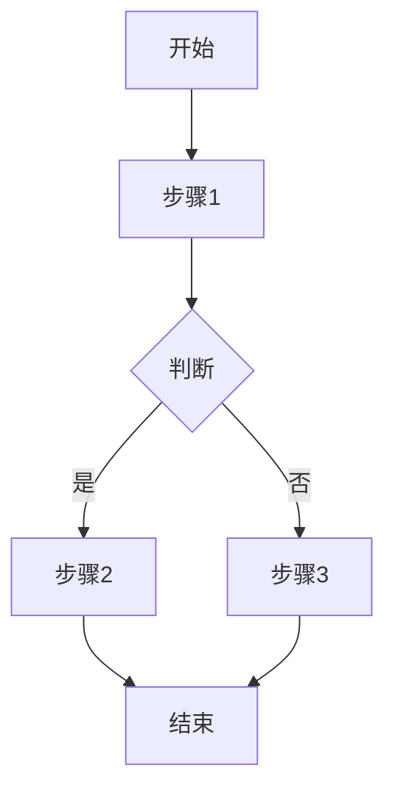

# 技术设计模板

> 技术设计文档（Technical Design Document）模板

---

## 文档信息

| 字段 | 内容 |
|------|------|
| 项目名称 | |
| 文档版本 | v1.0.0 |
| 创建日期 | |
| 作者 | |
| 状态 | Draft / Review / Approved |

---

## 1. 概述

### 1.1 背景与目标
- 为什么需要这个设计？
- 要解决什么技术问题？

### 1.2 范围
- **包含**: [列出设计范围内的内容]
- **不包含**: [明确排除的内容]

---

## 2. 系统架构

### 2.1 架构图
```
[放置架构图或使用 ASCII 艺术]
```

### 2.2 架构说明
- [描述整体架构设计思路]
- [解释关键组件的职责]

### 2.3 技术选型
| 技术 | 版本 | 用途 | 选择理由 |
|------|------|------|----------|
| | | | |

---

## 3. 详细设计

### 3.1 核心模块

#### 模块 A: [名称]
- **职责**: [描述]
- **接口**:
  ```python
  # 接口定义或描述
  ```
- **关键逻辑**: [描述]

#### 模块 B: [名称]
- ...

### 3.2 数据模型

| 实体 | 字段 | 类型 | 说明 |
|------|------|------|------|
| | | | |

### 3.3 API 设计

| 端点 | 方法 | 请求 | 响应 | 说明 |
|------|------|------|------|------|
| | | | | |

---

## 4. 流程设计

### 4.1 [流程名称]



### 4.2 错误处理
| 错误类型 | 处理方式 | 用户反馈 |
|----------|----------|----------|
| | | |

---

## 5. 质量属性

### 5.1 性能
- [性能要求和设计考虑]

### 5.2 可扩展性
- [扩展性设计]

### 5.3 安全性
- [安全考虑和措施]

### 5.4 可观测性
- **日志**: [日志策略]
- **指标**: [关键指标]
- **追踪**: [追踪方案]

---

## 6. 部署与运维

### 6.1 部署架构
```
[部署架构图]
```

### 6.2 配置管理
| 配置项 | 默认值 | 说明 |
|--------|--------|------|
| | | |

### 6.3 监控告警
| 指标 | 阈值 | 告警方式 |
|------|------|----------|
| | | |

---

## 7. 测试策略

### 7.1 测试类型
| 类型 | 覆盖范围 | 工具 |
|------|----------|------|
| 单元测试 | | |
| 集成测试 | | |
| 端到端测试 | | |

### 7.2 测试用例
| 场景 | 输入 | 预期输出 |
|------|------|----------|
| | | |

---

## 8. 迁移计划

### 8.1 数据迁移
- [迁移策略]

### 8.2 灰度方案
- [灰度发布策略]

### 8.3 回滚方案
- [回滚条件和步骤]

---

## 9. 风险与依赖

### 9.1 技术风险
| 风险 | 影响 | 缓解方案 |
|------|------|----------|
| | | |

### 9.2 依赖项
| 依赖 | 版本要求 | 风险 |
|------|----------|------|
| | | |

---

## 10. 附录

### 10.1 参考文档
- [相关链接]

### 10.2 变更历史
| 版本 | 日期 | 变更内容 | 作者 |
|------|------|----------|------|
| | | | |
